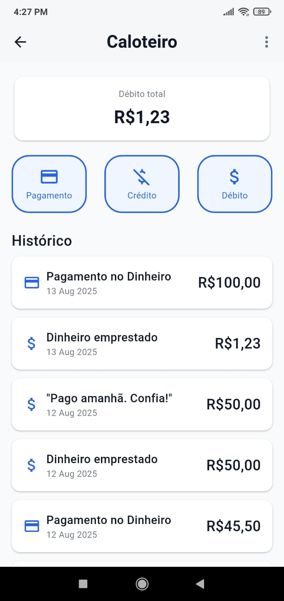
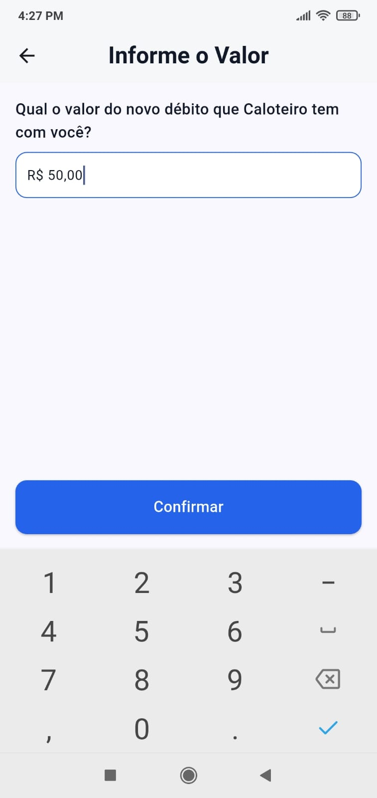
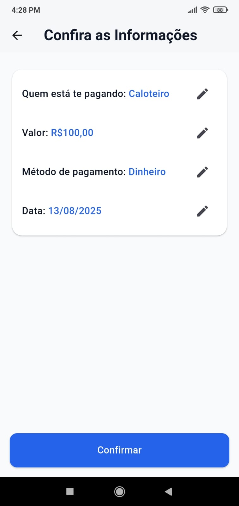

# OweMe

**A simple Flutter app to track personal debts, credits, and payments.**

---

## 📋 Table of Contents

- [About the Project](#-about-the-project)
- [Key Features](#-key-features)
- [Screenshots](#%EF%B8%8F-screenshots)
- [Architecture & Technologies Used](#%EF%B8%8F-architecture--technologies-used)
- [Getting Started](#-getting-started)
- [Challenges & Learning Journey](#-challenges--learning-journey)
- [Current Status & Roadmap](#%EF%B8%8F-current-status--roadmap)
- [Contact](#-contact)
- [License](#-license)

---

## 🧭 About the Project

**OweMe** is a small personal project I built to practice my Flutter development skills. While I often find myself manually tracking small debts and credits between friends or family, I thought it would be a nice bonus to automate that process with an app.

The main goal of this project, though, was to explore mobile app architecture, state management, and local data persistence in a more structured and hands-on way.

It’s still in development, but it already covers the basic functionality I had in mind.

---

## ✨ Key Features

- **Manage Debtors**  
  Keep a list of people who owe you or whom you owe.

- **Log Records**  
  Add debts (they owe you), credits (you owe them), and payments (of their debt).

- **View Balances**  
  See the current balance for each person and a global total.

- **Transaction History**  
  View a list of all records for each debtor for better tracking and accountability.

---

## 🖼️ Screenshots

<details open>
  <summary><strong>Home Page & Debtor Page</strong></summary>
  
  
</details>

<details open>
  <summary><strong>New Debt Record Flow</strong></summary>
  
  
  
  
  
</details>

<details open>
  <summary><strong>New Payment Record Flow</strong></summary>
  
  
  
</details>

---

## 🏗️ Architecture & Technologies Used

OweMe follows **Clean Architecture** combined with the **BLoC pattern** to ensure separation of concerns and maintainability.

### Layers Overview
- **Presentation**: UI components (pages, widgets), BLoCs for state management, drafts, and mappers.
- **Domain**: Core business logic with use cases, entities, and repository interfaces.
- **Data**: Repositories, data sources, models, and adapters that handle persistence.

### Application Flow
User interaction begins in the **presentation layer**, where widgets communicate with BLoCs through events and states.  
BLoCs handle business logic by invoking **use cases** in the **domain layer**.  
The **domain** remains independent, defining repository interfaces that the **data layer** implements to keep dependencies pointing inward, following the Dependency Inversion principle.  
Finally, the **data layer** interacts with the local database using `sqflite`, and in the future, will integrate with remote APIs.

### Architecture Diagram
<p align="center">
  
</p>

### Tech Stack
- **Architecture**: Clean Architecture (presentation, domain, data)
- **State Management**: `flutter_bloc`
- **Local Database**: `sqflite`
- **Dependency Injection**: `get_it`
- **Unit Testing**: `flutter_test`, `mocktail`
- **Framework**: Flutter
- **Language**: Dart

### Project Structure

```bash
lib/
│
├── src/                     # Source code directory
│   ├── app/                 # Application setup and core components
│   │   ├── di/              # Dependency injection configuration
│   │   ├── app.dart         # Main application widget
│   │   └── bootstrap.dart   # Application bootstrapping logic
│   ├── core/                # Core utilities
│   │   ├── presentation/    # Design system, ui formatters, etc.
│   │   └── shared/          # Utilities shared across layers
│   ├── data/                # Data layer
│   │   ├── adapters/        # Entity <-> Model conversion
│   │   ├── data_sources/    # Data sources (e.g., APIs, databases)
│   │   ├── models/          # Data models
│   │   └── repositories/    # Concrete repository implementations
│   ├── domain/              # Domain Layer
│   │   ├── entities/        # Core business entities
│   │   ├── enums/           # Enums for the domain
│   │   ├── repositories/    # Repository interfaces
│   │   └── use_cases/       # Business logic use cases
│   └── presentation/        # Presentation layer (UI)
│       ├── blocs/           # BLoC (Business Logic Component) classes
│       └── containers/      # Page containers
│       ├── drafts/          # Draft or temporary UI components
│       ├── mappers/         # Draft <-> Entity conversion
│       ├── pages/           # Application pages/screens
│       └── widgets/         # UI widgets
└── main.dart                # Application's entry point
```

This layout helps organize the code and keep responsibilities separate.

---

## 🚀 Getting Started

> If you’d like to try it out locally, here’s how:

### Prerequisites

- Flutter SDK (3.x or higher)
- Android Studio or VSCode
- A connected device or emulator

### Installation

```bash
git clone https://github.com/janpierry/oweme.git
cd oweme
flutter pub get
```

### Run the App

```bash
flutter run
```

---

## 📚 Challenges & Learning Journey

Although I was already familiar with Clean Architecture and BLoC, this was my first time working with `sqflite` for local data persistence. I learned how to:

- Set up a local database
- Create and manage tables
- Perform CRUD operations

It was a great learning experience and gave me more confidence working with local storage in Flutter.

---

## 🛠️ Current Status & Roadmap

### ✅ What Works:
- Adding and managing debtors
- Adding, editing, and deleting debts, credits, and payments
- Viewing balances and record history

---

### 🔧 Next Steps to MVP:
- [ ] Add error handling

---

### 🚀 Future Ideas:
- [ ] Add visual charts for balance trends
- [ ] Add user authentication
- [ ] Add integration with Firebase Crashlytics
- [ ] Implement filters for the record list
- [ ] Polish the UI for better usability
- [ ] Add remote storage
- [ ] Improve test coverage

---

## 👤 Contact

If you're a recruiter, developer, or just curious—thanks for checking out this project! Feel free to reach out:

**Jan Pierry**  
📧 janpierrycoelho@gmail.com
🌐 [LinkedIn](https://www.linkedin.com/in/jan-pierry/)
📂 [GitHub Profile](https://github.com/janpierry)

---

## 📝 License

This project is open source and available under the [MIT License](LICENSE).